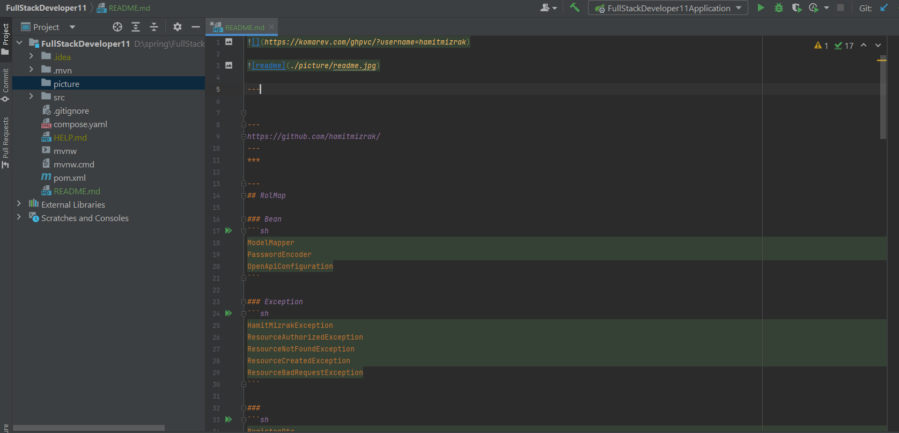

[Full Stack 11](https://github.com/hamitmizrak/FullStackDeveloper11.git)

---
## RoadMap
- Java
- React
- Database

---

## Technology
- *Java*  **Core**
- *Java* `Spring Boot`
- React JS
---

## Git initial
> git init <br/>
> git add . <br/>
> git commit -m "initial data" <br/>
> ssh-keygen -t rsa -b 4096 -C "hamitmizrak@gmail.com" <br/>
> cat ~/.ssh/id_rsa.pub <br/>
> git remote add gitlab URL <br/>
> git remote add github  https://github.com/hamitmizrak/FullStackDeveloper11.git <br/>

## Git Branch Codes
- Dikkat: branch yapmadan önce git add (staged tarafında olmalıdır)
- Dikkat: branch yapmadan önce git add sonra git commit yapmalıyız.
> git branch <br/>
> git branch frontend<br/>
> git checkout frontend<br/>
> git switch frontend<br/>
> 
> git checkout -b frontend<br/>
> git checkout -b backend<br/>
> git checkout master
> git merge backend
> git merge --no-ff backend
> git merge squash
> git merge rebase

---

### Bean
```sh
ModelMapper
PasswordEncoder
OpenApiConfiguration
```
---
### Exception
```sh
HamitMizrakException
ResourceAuthorizedException
ResourceNotFoundException
ResourceCreatedException
ResourceBadRequestException
```
---
### 
```sh
RegisterDto
BaseEntity
RegisterEntity
IRegisterRepository
```

---
#  Java Full Stack Developer -7 (1 Nisan  2023)
* [GitHub](https://github.com/hamitmizrak/Turgut_Ozal_University_JavaTutorialsCommonData)
*
### Gereksinimler
Java 19
intellij idea Ultimate
Visual Studio Code
Node js
---

## Visual Studio codes
Extensisons
- Browser preview
- Auto Close tag
- tabnine
- Auto import
- Auto rename tag
- Bootstrap 5 Quick Snipperts
- Bracket Pair Colorizer 2
- Css Snippet
- Es7+ React/REdux/React-Native snippets
- Html Snippets
- JsQuery Snippets
- Live Server
- Material Icon Theme
- Open-in-Browser
- Path Intellisense
- Prettier Code formatter
- Project Manager
- Reactjs code Snippets
---

## Tecnology
##FrontEnd
- Html5
- Css3
- responsive design
- Js
- jquery
- Bootstrap
- react


---

## BackEnd
* javase
* jdbc crud native
* hibernate
* spring core
* spring mvc
* spring data
* spring rest
* spring security

---

## Libraries
Thymeleaf
Lombok
Validation

## Database
H2 Database
Mysql
Postgresql

---
## dependency
Spring Web
Spring Data JPA
Spring Rest
Spring Security

---
# Spring Tools
Spring Boot DevTools
Spring Configuration Processor
Spring Boot Actuator

---

## Docker Deployment

1.ADIM
npx create-react-app frontend
cd frontend
npm start
code .

2.ADIM
NOT: node_modules siliyoruz bunu sonrasında
npm i

3.ADIM
terminal: package.json seviyesinde olacak şekilde
npm install axios
npm install bootstrap --save
npm install node-sass --save


---